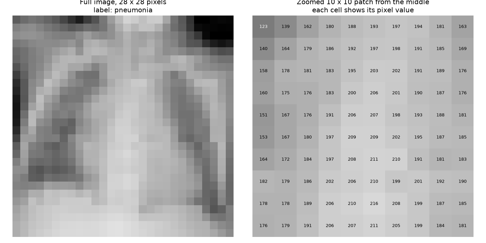
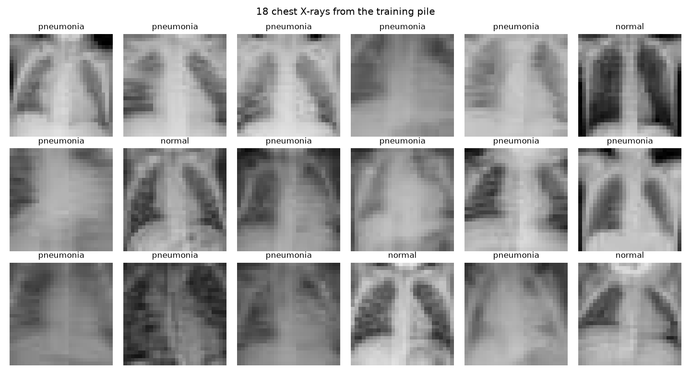
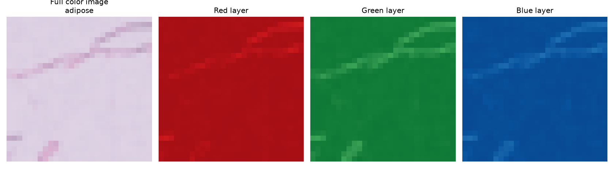
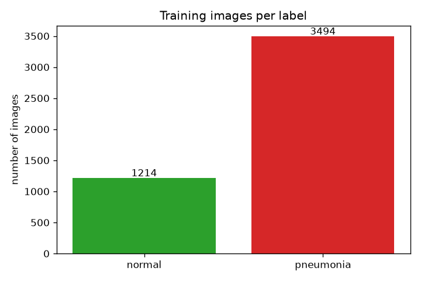

# Lesson 1: An image is just a grid of numbers

## The idea in one paragraph

To a computer, a picture is a table of numbers. Each cell of the table is one tiny dot, called a pixel.
For a black and white image, each number says how bright that dot is: 0 is black, 255 is white,
and everything in between is a shade of grey. A color image is three of these tables stacked together,
one for red, one for green and one for blue. That is all an image is. Every model we build later
just does math on these numbers.

## What this lesson does

1. Downloads a tiny set of chest X-rays (about 4 MB). Each is 28 by 28 pixels.
2. Takes one X-ray and prints its raw numbers so you can see them with your own eyes.
3. Draws the X-ray big, with the pixel values written on top.
4. Shows a grid of X-rays with their labels, "normal" or "pneumonia".
5. Loads a color image of tissue and pulls apart its red, green and blue layers.
6. Counts how many images of each label there are. This matters later, because a model that
   sees far more of one kind can get lazy and just always guess that kind.

## Run it

```bash
source .venv/bin/activate
python 01_images_are_numbers/lesson.py
```

Pictures are saved into `01_images_are_numbers/outputs/`.

## Words you will meet

| Word | Plain meaning |
|---|---|
| pixel | one dot in the image, stored as a number |
| grayscale | black and white image, one number per pixel |
| channel | one color layer. Color images have three: red, green, blue |
| shape | the size of the grid, written as (rows, columns) or (rows, columns, channels) |
| label | the answer attached to an image, like "normal" or "pneumonia" |
| dataset | a collection of images with their labels |
| train / val / test split | the dataset cut into three piles: one to learn from, one to check while learning, one for the final exam |

## Check yourself

- If an image has shape (28, 28), how many numbers does it hold? (Answer: 784)
- What value is a pure white pixel? What about pure black?
- Why does a color image have shape (28, 28, 3) and not (28, 28)?

## Results








