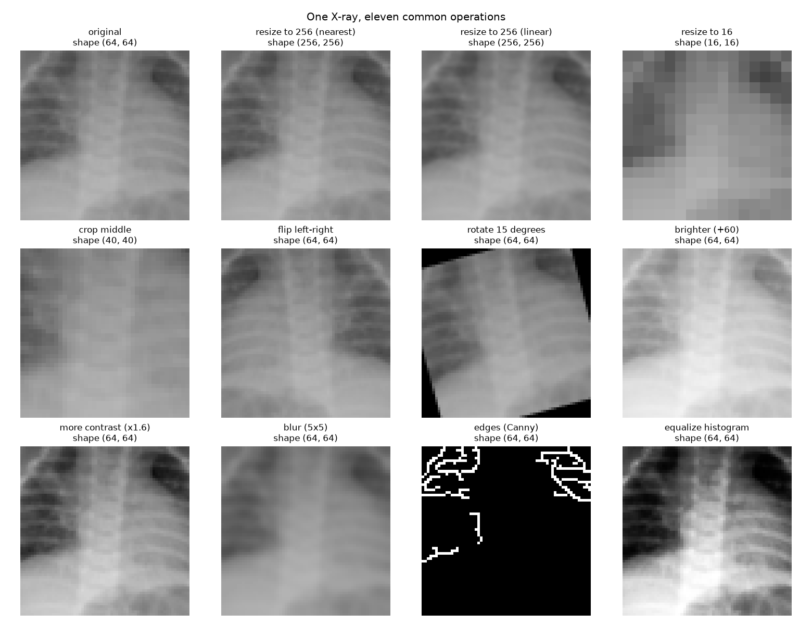
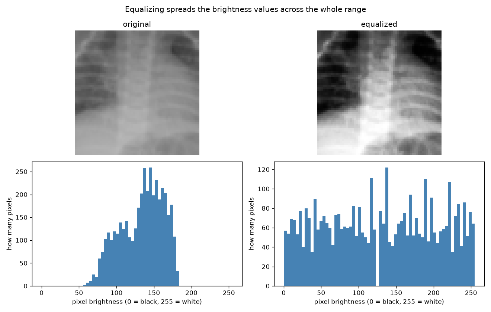

# Lesson 2: Changing images

## The idea in one paragraph

Since an image is a grid of numbers, changing the image means changing the numbers.
Making it brighter is adding to every number. Flipping it is reversing the order of the columns.
Cropping is keeping only part of the grid. Blurring is replacing each number with the average of its
neighbours. These simple operations are the daily tools of computer vision work, and later we will use
them to make many slightly different copies of each training image so a model learns better.
That trick is called data augmentation.

## What this lesson does

Takes one chest X-ray (64 by 64 pixels this time, so it is easier to see) and runs it through
eleven common operations, then saves a before-and-after picture of all of them. It also shows what
"normalizing" means: squashing the pixel numbers from the 0 to 255 range into a small range,
because neural networks train much better on small numbers.

## Run it

```bash
source .venv/bin/activate
python 02_changing_images/lesson.py
```

Pictures are saved into `02_changing_images/outputs/`.

## The operations, in plain words

| Operation | What it does to the numbers | Why you would use it |
|---|---|---|
| resize bigger | invents new pixels between the old ones | models usually want one fixed input size |
| resize smaller | throws pixels away | faster training, less memory |
| crop | keeps a rectangle of the grid | focus on the lungs, drop the empty border |
| flip | reverses the column order | more training variety for free |
| rotate | moves each pixel around the centre | scans are never perfectly straight |
| brighter | adds a constant to every pixel | handle dark scans, more variety |
| more contrast | pushes values away from the middle grey | make faint details stand out |
| blur | each pixel becomes the average of its neighbours | remove noise before other steps |
| edges | marks where brightness changes sharply | find outlines of organs |
| equalize | spreads the brightness values out evenly | very common fix for X-rays |
| normalize | scales 0..255 down to 0..1, or to numbers centred on 0 | neural networks need this to train well |

## Words you will meet

| Word | Plain meaning |
|---|---|
| interpolation | the rule for inventing new pixels when you resize. "nearest" copies the closest pixel and looks blocky. "linear" blends neighbours and looks smooth |
| kernel | the small square of neighbours used by blur and edge finders. A 5 by 5 kernel looks at 25 pixels at once |
| histogram | a bar chart of how many pixels have each brightness value |
| normalize | squash the pixel numbers into a small range |
| standardize | a kind of normalize: subtract the average and divide by the spread, so values centre on 0 |
| data augmentation | making altered copies of training images (flips, rotations, brightness changes) so the model sees more variety |

## Check yourself

- If you flip an X-ray left to right, is the heart still on the correct side? Why might that matter for a medical model?
- After dividing all pixels by 255, what is the biggest possible value?
- Why does resizing a 64 by 64 image up to 256 by 256 not add any real detail?

## Results




