# Lesson 3: Math you will lean on

Four pieces of math keep showing up in computer vision, in interviews, and in every paper you will read:

- **A.** The singular value decomposition (SVD), with range and null space
- **B.** The multivariate Gaussian and conditioning
- **C.** Jacobians and the divergence of a vector field
- **D.** Conditional expectation

This lesson explains each one in plain words first, then shows it in pictures made from real chest X-rays,
and only then gives the formula. The last step is to read the matching pages of two free books:

- Boyd and Vandenberghe, *Introduction to Applied Linear Algebra* (I call it "Boyd" below).
  Free PDF: https://web.stanford.edu/~boyd/vmls/vmls.pdf
- Murphy, *Probabilistic Machine Learning: An Introduction* (I call it "Murphy" below).
  Free PDF: https://probml.github.io/pml-book/book1.html

One honest note. Boyd's book deliberately leaves out the SVD and eigenvalues (its appendix D says so).
It is still the best place to build the basics: vectors, matrices as machines, linear independence,
and the derivative matrix. For the SVD itself, read Murphy's linear algebra chapter.

## How to use this lesson

1. Read the "idea in plain words" for one part.
2. Run that part's script and look at the pictures.
3. Read the formula with the pictures still in front of you.
4. Then read the book sections in the table. They will feel familiar instead of scary.

## Run it

```bash
source .venv/bin/activate
python 03_math_you_will_lean_on/a_svd_range_null_space.py
python 03_math_you_will_lean_on/b_gaussian_conditioning.py
python 03_math_you_will_lean_on/c_jacobian_divergence.py
python 03_math_you_will_lean_on/d_conditional_expectation.py
```

Pictures are saved into `03_math_you_will_lean_on/outputs/`.

---

## Part A: the SVD, range and null space

### The idea in plain words

A matrix is a machine: a vector goes in, a vector comes out. The SVD says that every such machine,
no matter how messy its numbers look, does only three simple things:

1. Turn the input (that is the matrix V).
2. Stretch it along each axis by some amount (the singular values, written s1, s2, ...).
3. Turn the result (that is the matrix U).

The stretch amounts are the whole story. A big singular value means that input direction survives
strongly. A singular value of zero means that input direction is erased completely.

From this, three words that interviewers love:

| Word | Plain meaning | In SVD terms |
|---|---|---|
| range | every output the machine can produce | the output directions (columns of U) with non-zero stretch |
| null space | every input that comes out as exactly zero | the input directions (columns of V) with zero stretch |
| rank | how many independent directions survive | the number of non-zero singular values |

If an input direction is in the null space, the information in it is gone forever. No later step can
bring it back. That one sentence explains why un-blurring a photo is so hard (picture A4 below).

### The formula

For any matrix A with m rows and n columns:

```
A = U S V^T
```

- V^T means V flipped (rows become columns). Columns of V are the input directions v1, v2, ...
- S is a diagonal matrix holding the singular values s1 >= s2 >= ... >= 0
- Columns of U are the output directions u1, u2, ...

The cleanest way to remember it: `A v_i = s_i u_i`. Feed in direction v_i, get out direction u_i stretched by s_i.

Keep only the first k pieces and you get the best possible k-piece approximation of A. That is what
pictures A2 and A3 use.

### The pictures

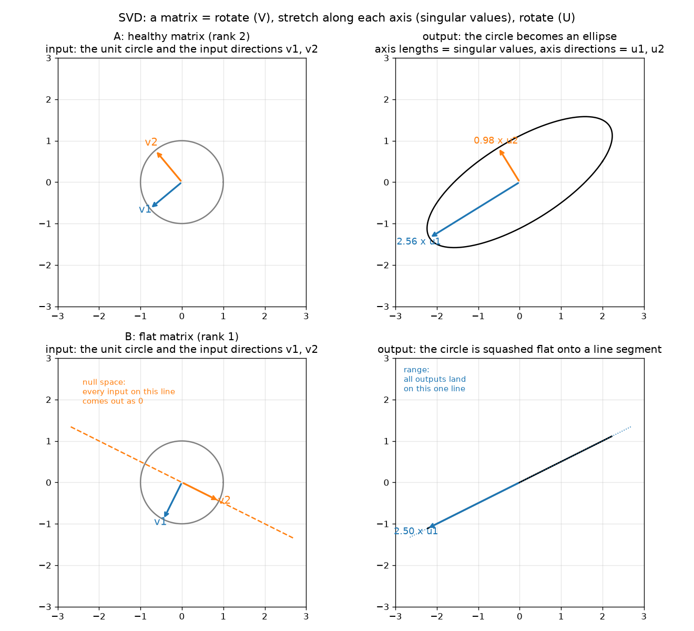

Top row: a healthy 2 by 2 matrix turns the circle into an ellipse. The ellipse's axis lengths are the
singular values, its axis directions are u1 and u2. Bottom row: a flat matrix (rank 1) squashes the circle
onto a line. That line is the range. The dashed line on the left is the null space: every input on it comes out as zero.

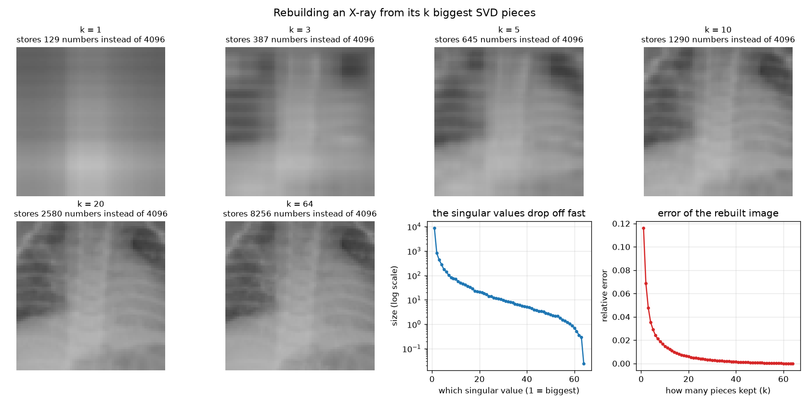

An image is a matrix, so it has an SVD. With only 10 of 64 pieces the X-ray is already recognizable.
The singular values drop off fast, which is why this works.

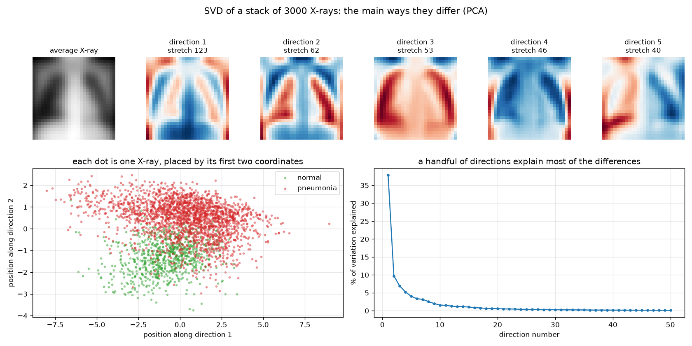

Stack 3000 X-rays as rows of one tall matrix and take its SVD. The input directions are now whole
images: the main ways X-rays differ from each other. This is called principal component analysis (PCA),
and it is the same math. Two numbers per X-ray already separate normal from pneumonia fairly well.

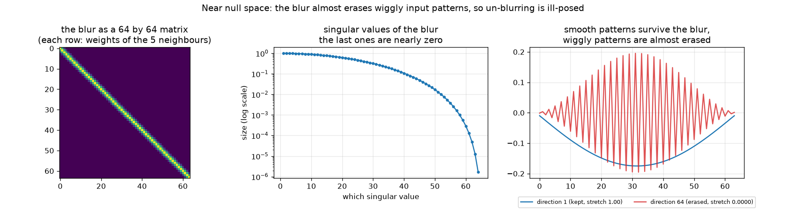

Blurring a row of 64 pixels is a 64 by 64 matrix. Its smallest singular values are nearly zero, and the
input directions that go with them are wiggly patterns. Blur almost erases wiggles. Once erased, no
method can recover them exactly, so "un-blur" is only ever a guess.

### Where you will meet it in computer vision

- Compressing images and model weights (keep the biggest pieces).
- PCA for looking at a dataset, and for whitening data before training.
- Adapting huge pretrained models cheaply by adding a low-rank matrix (the method called LoRA is exactly "a matrix with few non-zero singular values").
- Understanding a linear layer in a network: which input patterns it keeps and which it throws away.
- Solving least squares problems through the pseudo-inverse.

### Read more

| Topic | Where |
|---|---|
| Vectors, inner product, what a matrix does to a vector | Boyd, Chapters 1 and 6 (especially 6.4) |
| Linear independence, basis, orthonormal vectors (the ground under rank, range and null space) | Boyd, Chapter 5 |
| Geometric transformations as matrices, convolution as a matrix (our blur) | Boyd, Sections 7.1 and 7.4 |
| Pseudo-inverse | Boyd, Section 11.5 |
| Eigenvalues and eigenvectors | Murphy, Section 7.4 |
| The SVD, its link to eigenvalues, range and null space, truncated SVD | Murphy, Sections 7.5.1 to 7.5.5 |
| PCA | Murphy, Section 20.1 |

---

## Part B: the multivariate Gaussian and conditioning

### The idea in plain words

A Gaussian over one number is the familiar bell curve: a centre (the mean) and a width (the spread).
A Gaussian over several numbers at once is a smooth hill over a map. Two things describe it:

- the **mean**: where the top of the hill is
- the **covariance**: a square table of numbers that gives the hill its shape. The diagonal entries are
  each variable's own spread. The off-diagonal entries say how pairs of variables move together.
  Positive means "when one is high, the other tends to be high too".

Cut the hill horizontally and you get ellipses. The ellipse axes are the eigenvectors of the covariance.
That is the same math as the SVD from part A, applied to the covariance table.

**Conditioning** is the key trick. Suppose you learn the exact value of some of the variables.
Slice the hill at that spot. The slice is again a Gaussian, with:

- a **moved centre**: your guess for the unknown variables shifts, by an amount that depends on how
  surprising the observed values were and how strongly the variables move together
- a **narrower spread**: you are now more certain, and by a fixed amount that does not depend on what you saw

This is the whole reason Gaussians are everywhere: observing part of the world updates your belief about
the rest with a formula you can write in one line.

### The formula

Split the variables into the ones you observed (o) and the missing ones (m). Split the mean and the
covariance the same way. Then, after seeing the values x_o:

```
new mean of m        = mu_m  +  S_mo  S_oo^-1  (x_o - mu_o)
new covariance of m  = S_mm  -  S_mo  S_oo^-1  S_om
```

Read it as: `new guess = old guess + gain x surprise`, where the gain is `S_mo S_oo^-1`.
The "surprise" is how far the observed values were from what you expected.

### The pictures

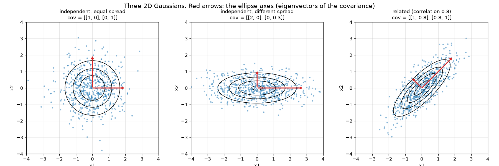

Same centre, three covariances. The red arrows are the ellipse axes.

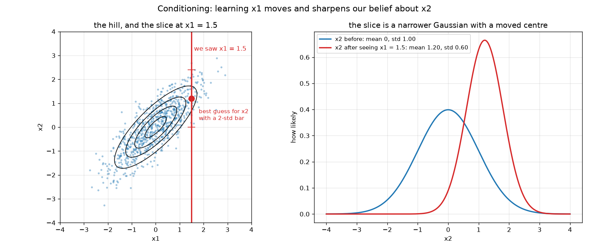

We observe x1 = 1.5. The red slice gives a new Gaussian for x2: its centre moved from 0 to 1.2
and its spread shrank from 1.0 to 0.6. Work it by hand: new mean = 0 + 0.8 / 1 x 1.5 = 1.2,
new variance = 1 - 0.8 x 0.8 / 1 = 0.36, so the spread (square root) is 0.6.

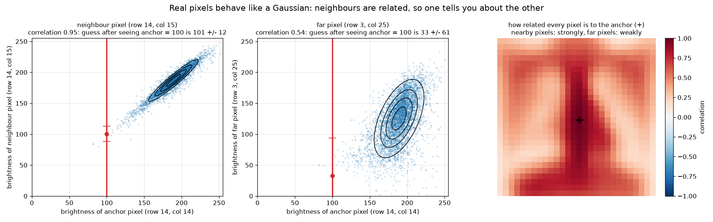

Real X-ray pixels behave like this. Two neighbouring pixels have correlation 0.95, so knowing one almost
pins down the other. A far-away pixel has correlation 0.54, so knowing the anchor helps a little but not
much. The right panel shows how related every pixel is to the anchor: a smooth blob that fades with distance.

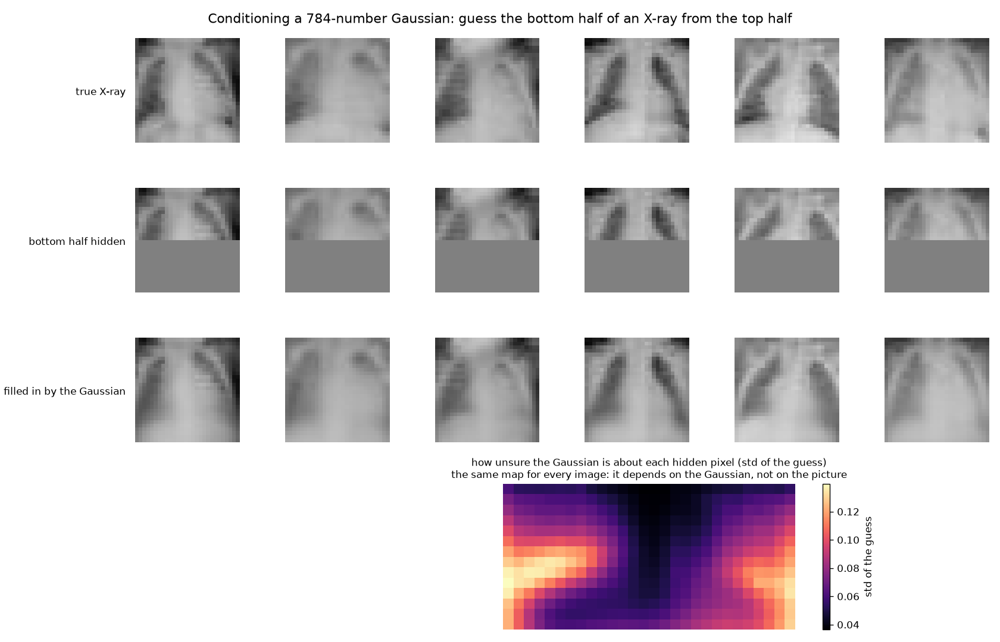

The big finish. Treat each X-ray as 784 numbers and fit one Gaussian to all of them (a mean image and a
784 by 784 covariance). Hide the bottom half of a test X-ray and apply the conditioning formula.
The guess is blurry but clearly right about the shape of the lungs and the diaphragm.
It halves the error compared with pasting in the average bottom half. No neural network was involved.
The bottom panel shows where the Gaussian is unsure: the edges, where X-rays vary most.

### Where you will meet it in computer vision

- Noise models: "the camera adds Gaussian noise" is the standard starting assumption.
- Tracking an object over video frames (the Kalman filter is this conditioning formula, applied again and again).
- Diffusion models, which make images by adding Gaussian noise and learning to remove it.
- Spotting unusual images by measuring how far they sit from the centre of the hill (the Mahalanobis distance, which is just "distance measured in units of the ellipse").
- Gaussian processes and Bayesian linear regression, which are conditioning applied to functions.

### Read more

| Topic | Where |
|---|---|
| Standard deviation and correlation as angles between vectors | Boyd, Sections 3.3 and 3.4 |
| The one-variable Gaussian and why it is used so much | Murphy, Section 2.6 |
| The multivariate Gaussian: definition, Mahalanobis distance, marginals and conditionals | Murphy, Sections 3.2.1 to 3.2.3 |
| Worked example: conditioning a 2D Gaussian | Murphy, Section 3.2.4 |
| Worked example: filling in missing values (our picture B4) | Murphy, Section 3.2.5 |
| Linear Gaussian systems and Bayes rule for Gaussians | Murphy, Section 3.3 |
| Deriving the conditioning formula with matrix algebra | Murphy, Section 7.3.5 |

---

## Part C: Jacobians and divergence

### The idea in plain words

Take any smooth map that bends space: a warp that turns one picture into another, or a neural network
that turns pixels into a score. Zoom in far enough on any one point and the bending disappears. The map
looks flat, like a matrix. **The Jacobian is that matrix.** Its entry in row i, column j answers:
"if I nudge input j a tiny bit, how much does output i move?"

Two numbers you can read off the Jacobian:

- **Determinant**: by what factor a tiny patch of area (or volume) is scaled. Above 1: things grew.
  Below 1: things shrank. Negative: the patch was flipped inside out (in medical warps that means
  tissue folded over itself, which is physically impossible and a sign the warp is bad).
- **Divergence**: for a field of arrows (a vector field), the sum of the Jacobian's diagonal. It says
  whether the arrows at a point spread out (positive), squeeze in (negative), or neither (zero).
  Think of water: a tap has positive divergence, a drain negative, a whirlpool zero.

### The formula

For a map f that takes n inputs to m outputs, the Jacobian J is an m by n matrix with

```
J[i, j] = d f_i / d x_j        (how output i changes per tiny change of input j)
```

Near a point p, the map is well approximated by `f(p + h) is about f(p) + J h`.

For a vector field v with components (v_x, v_y):

```
divergence of v = d v_x / d x  +  d v_y / d y     (the trace of its Jacobian)
```

### The pictures

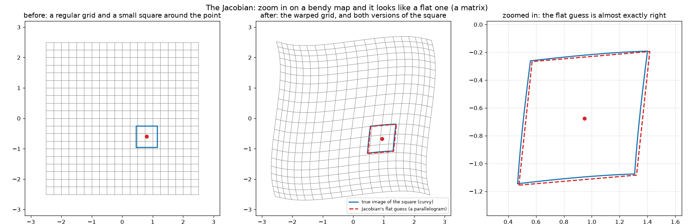

A small square around a point goes through a bendy warp. Its true image is slightly curvy (blue).
The Jacobian predicts a parallelogram (red dashed). Zoomed in, the two are almost identical.
The script also computes the Jacobian three ways: by hand, by nudging the inputs and measuring,
and with PyTorch's automatic differentiation. All three agree to three decimal places. That PyTorch
machinery is exactly what trains neural networks (Lessons 5 and 6).

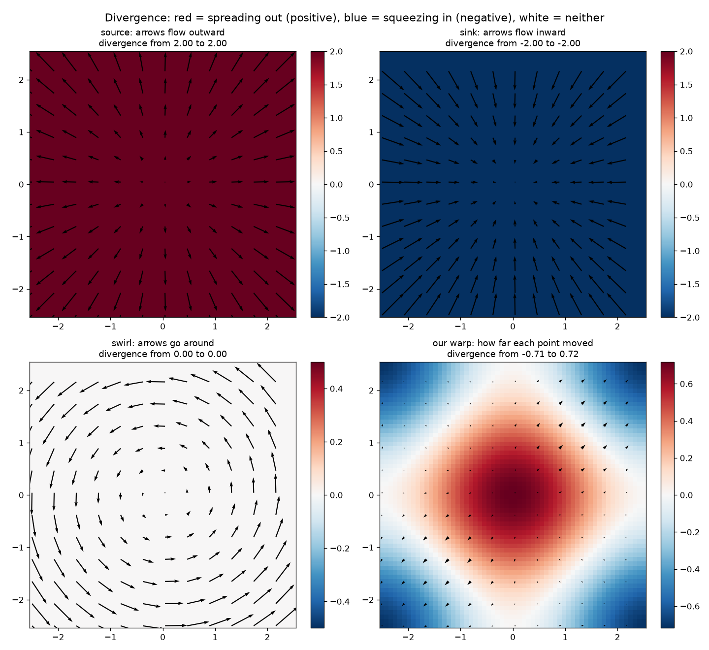

Red means arrows spread out, blue means they squeeze in. A source is red everywhere, a sink blue,
a swirl white (no spreading at all). Our warp's displacement field spreads in the middle and squeezes
at the corners.

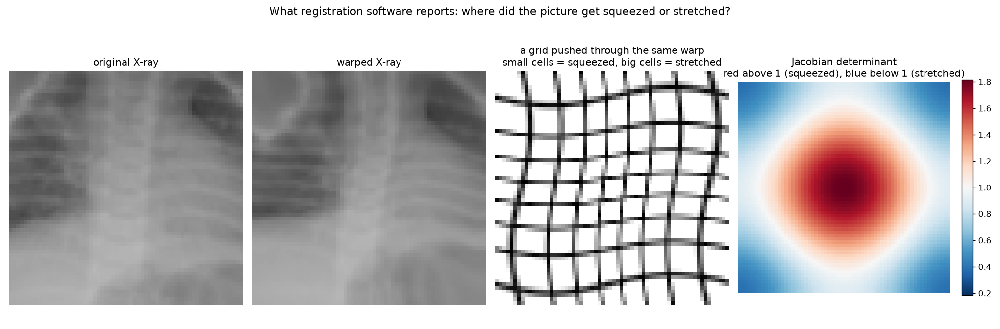

When two scans of the same patient are lined up (called image registration), the output is a warp.
Doctors then look at the Jacobian determinant map. Here the X-ray was pushed through our warp, along
with a grid so the squeeze and stretch are visible. The determinant map says the same thing in colour.

### Where you will meet it in computer vision

- Training neural networks: backpropagation is the chain rule, which multiplies Jacobians layer by layer.
- Saliency maps: the Jacobian of a network's score with respect to the input pixels shows which pixels mattered (Lesson 17).
- Image registration: Jacobian determinant maps show where tissue grew or shrank, and negative values flag folding.
- Optical flow (how pixels move between video frames) is a vector field. Its divergence tells you if the camera is moving forward (everything spreads out) or if an object is approaching.
- Generative models called normalizing flows need the log of the Jacobian determinant at every step.

### Read more

| Topic | Where |
|---|---|
| Taylor approximation (a map is almost flat up close) | Boyd, Section 2.2 |
| The derivative matrix (another name for the Jacobian) and its use in fitting | Boyd, Section 8.2 and Appendix C.1 |
| Matrix calculus and the Jacobian | Murphy, Sections 7.8.1 to 7.8.5 |
| How networks use Jacobians during training | Murphy, Section 13.3.3 |
| Divergence (neither book covers it) | Khan Academy's free "Divergence" article in its multivariable calculus unit, and the 3Blue1Brown video "Divergence and curl" |

---

## Part D: conditional expectation

### The idea in plain words

You want to guess a number Y, and you know a related number X. The **conditional expectation**,
written E[Y | X], is the average of Y among all the cases where X looks like yours.
Plot it against X and you get the "best guess curve".

Three facts make it the most important idea in all of machine learning:

1. It is the **best possible guess** if "best" means smallest average squared error. No cleverer
   formula can beat it. (If you measure error with absolute differences instead, the best guess is the median.)
2. When Y is a yes/no label written as 1/0, the average of Y is just the fraction of yes. So
   **E[Y | X] = P(Y = 1 | X)**. A classifier that outputs a probability is estimating a conditional expectation.
3. Averaging the best guesses over all X gives back the plain average of Y. (Called the law of total expectation. Plain version: the average of the group averages is the overall average, if you weight by group size.)

So: every regression model trained with squared error is trying to learn E[Y | X]. Every classifier
trained to output probabilities is trying to learn P(Y | X), which is the same thing. The network
is just a flexible way to draw the curve.

### The formula

```
E[Y | X = x]  =  average of Y over all cases with X = x
```

For jointly Gaussian X and Y it is a straight line (part B gave us that):

```
E[Y | X = x]  =  mu_Y  +  (cov(X, Y) / var(X)) (x - mu_X)
```

Best guess property: for any function g, `average of (Y - g(X))^2  >=  average of (Y - E[Y | X])^2`.

### The pictures

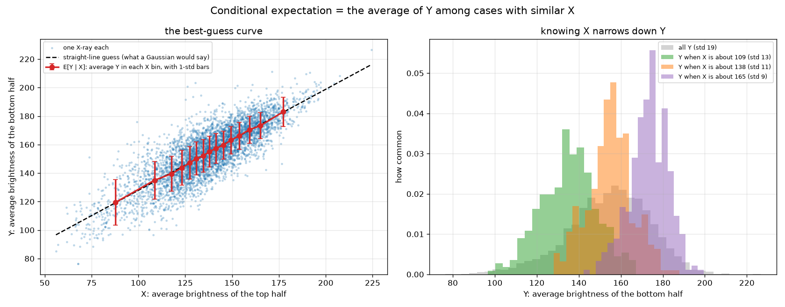

X is the average brightness of an X-ray's top half, Y of its bottom half. Red dots are the average Y
inside each X bin, which is E[Y | X] estimated from data. It almost sits on the straight line a Gaussian
would predict. The right panel shows that knowing X shrinks the spread of Y from 19 to about 11.

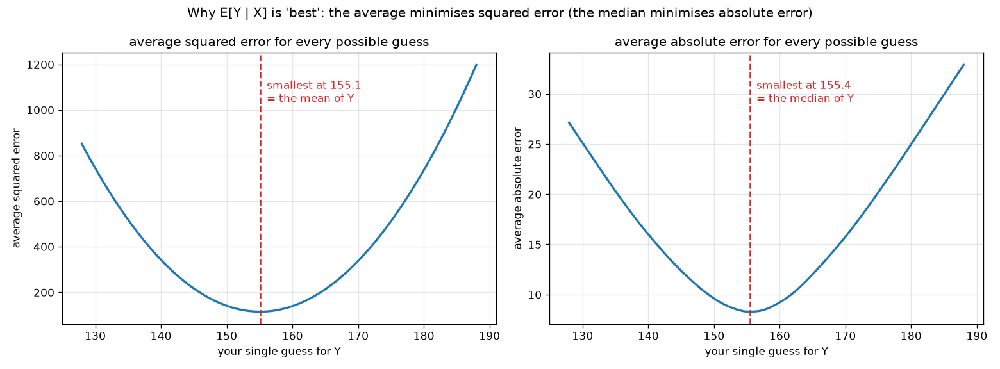

Take all X-rays in one bin and try every possible single guess. Squared error is smallest exactly at the
mean. Absolute error is smallest at the median. The loss you train with decides what your model learns.

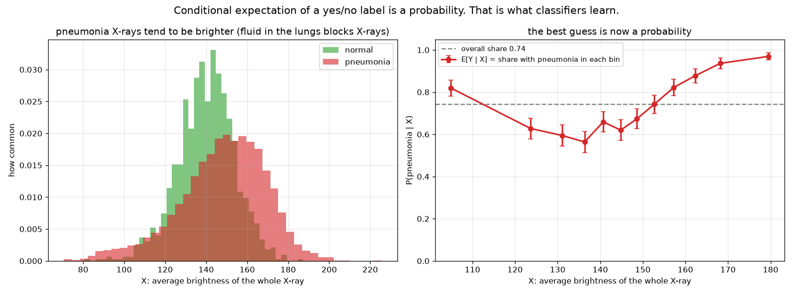

Now Y is the label (1 = pneumonia). E[Y | brightness] is the fraction with pneumonia in each brightness bin,
which is a probability. Notice the curve is not a straight line and not even one-directional: very dark
X-rays are mostly pneumonia too. The best guess curve is whatever the data says it is. That is why we use
flexible models later instead of straight lines.

### Where you will meet it in computer vision

- Any model trained with mean squared error (depth estimation, pose, denoising) learns E[Y | X].
- Any classifier trained with cross-entropy learns P(Y | X).
- Denoising networks and diffusion models predict E[clean image | noisy image], which is why their outputs can look slightly blurry: an average of many possible clean images is smooth.
- Choosing a loss: mean squared error gives the mean, absolute error gives the median, which is more robust to outliers.
- Calibration (Lesson 9): checking that a model's "0.8" really means pneumonia 80 percent of the time is checking that it learned E[Y | X] honestly.

### Read more

| Topic | Where |
|---|---|
| Least squares fitting, which is estimating E[Y | X] with a line | Boyd, Chapters 12 and 13 (13.2 on validation is gold) |
| Least squares classification (a 0/1 label fitted with a line) | Boyd, Chapter 14 |
| Expectation, variance and conditional probability basics | Murphy, Sections 2.1 to 2.2 |
| Why the mean minimises squared error and the median absolute error | Murphy, Section 5.1 (Bayesian decision theory), the part on regression problems |
| The conditional mean of a Gaussian is a straight line | Murphy, Section 3.2.3 |

---

## Words you will meet

| Word | Plain meaning |
|---|---|
| vector | a list of numbers, drawn as an arrow |
| matrix | a grid of numbers; also a machine that turns one vector into another |
| transpose (written ^T) | flip a matrix so rows become columns |
| singular values | how much a matrix stretches each of its special input directions |
| rank | how many directions survive the matrix |
| range | all outputs the matrix can make |
| null space | all inputs the matrix turns into zero |
| low-rank approximation | keep only the few biggest SVD pieces |
| eigenvector, eigenvalue | a direction a square matrix only stretches (no turning), and the stretch amount |
| PCA | principal component analysis: the SVD of a stack of data, used to find the main ways data varies |
| mean | the centre, the plain average |
| variance, standard deviation | how spread out values are; the standard deviation is the square root of the variance |
| covariance | how two variables move together; a table of these for all pairs |
| correlation | covariance scaled to lie between -1 and 1 |
| marginal | the distribution of one variable when you ignore the others |
| conditional | the distribution of some variables once you know the others |
| Mahalanobis distance | distance from the centre of a Gaussian, measured in units of its ellipse |
| derivative | how fast one output changes per tiny change of one input |
| partial derivative | the same, when there are several inputs and you change only one |
| Jacobian | the matrix of all partial derivatives of a map with several inputs and outputs |
| determinant | the factor by which a matrix scales area (2D) or volume (3D); negative means flipped |
| trace | the sum of a square matrix's diagonal |
| vector field | an arrow attached to every point of space |
| divergence | how much the arrows spread out at a point; the trace of the field's Jacobian |
| expectation | a fancy word for average |
| conditional expectation E[Y given X] | the average of Y among cases with a given X; the best guess curve |
| loss | the number a model is trained to make small, like average squared error |

## Check yourself

- A 3 by 3 matrix has singular values 5, 2 and 0. What is its rank? How big is its null space? Can it be undone?
- In picture A2, why does k = 64 store more numbers than the original image?
- Two pixels have correlation 0.95. You learn one of them is much darker than usual. Which way does your guess for the other move, and does your uncertainty about it go up or down?
- In the conditioning formula, why does the new covariance not depend on the values you observed?
- A warp has Jacobian determinant 0.5 at some point. Did that spot grow or shrink? What would a determinant of -0.5 mean for a medical scan?
- A vector field has divergence zero everywhere. If it describes water flow, what does that say about the water?
- You train a model with absolute error instead of squared error. What quantity is it learning to output?
- A classifier outputs 0.7 for an X-ray. Finish the sentence: "If the model is honest, then among all X-rays that look like this one, ..."
